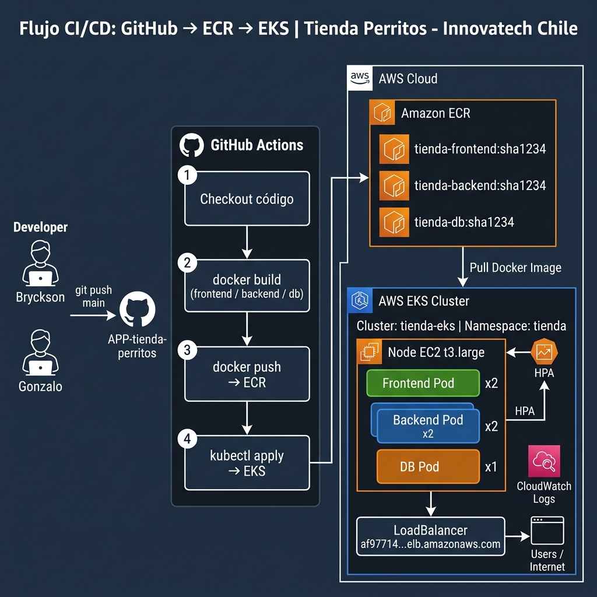

# Tienda de Perritos - AWS EKS & CI/CD 🐶

Este proyecto es una aplicación web multicapa (Frontend, Backend, Base de Datos) contenerizada y orquestada en **Amazon EKS (Elastic Kubernetes Service)**. Fue desarrollada como parte de la **Actividad 3.2: Implementación de clústeres de contenedores en AWS con EKS**.

## 🏗️ Arquitectura del Proyecto

El sistema está compuesto por tres capas principales:
1. **Frontend**: Aplicación estática servida con NGINX que actúa como proxy reverso hacia el backend.
2. **Backend**: API construida en Node.js/Express que gestiona las operaciones CRUD de los productos.
3. **Base de Datos**: MySQL (Desplegado en el clúster con un volumen efímero/EmptyDir para pruebas).



## 🗂️ Estructura del Repositorio

- `/frontend`: Código fuente de la interfaz web, configuración de NGINX (`default.conf`) y su `Dockerfile`.
- `/backend`: Código fuente de la API Node.js y su `Dockerfile`.
- `/db`: Archivos de configuración inicial para la base de datos MySQL (si aplica) y `Dockerfile`.
- `/k8s`: Manifiestos YAML de Kubernetes para el despliegue de toda la infraestructura:
  - Deployments, Services, ConfigMaps, Secrets.
  - Horizontal Pod Autoscaler (HPA) para Frontend y Backend.
- `/.github/workflows`: Pipeline de CI/CD automatizado con GitHub Actions.

## 🚀 Flujo CI/CD (GitHub Actions)

El proyecto cuenta con integración y despliegue continuo. Al hacer push a la rama `main`:
1. **GitHub Actions** detecta los cambios.
2. Construye la nueva imagen Docker (`frontend` o `backend`).
3. Sube la imagen a **Amazon ECR** etiquetada con el SHA del commit.
4. Se conecta al clúster de **EKS** y actualiza el Deployment (`kubectl set image`) de forma automática sin caída del servicio (Rolling Update).

## ⚙️ Despliegue Manual en Kubernetes (EKS)

Si deseas levantar el entorno de forma manual, asegúrate de estar conectado a tu clúster EKS y ejecuta los siguientes comandos desde la carpeta `k8s`:

### 1. Base de Datos (MySQL)
```bash
kubectl apply -f mysql-secret.yaml
kubectl apply -f mysql-deployment.yaml
kubectl apply -f mysql-service.yaml
```

### 2. Backend (Node.js)
```bash
kubectl apply -f backend-deployment.yaml
kubectl apply -f backend-service.yaml
```

### 3. Frontend (NGINX)
```bash
kubectl apply -f frontend-deployment.yaml
kubectl apply -f frontend-service.yaml
```
Para obtener la URL de acceso de la aplicación:
```bash
kubectl get svc tienda-frontend -n tienda
```
Copia el valor de `EXTERNAL-IP` (LoadBalancer) y ábrelo en tu navegador.

## 📈 Autoescalado y Tolerancia a Fallos

- **Auto-healing**: Kubernetes monitorea la salud de los contenedores a través de `livenessProbe` y `readinessProbe`. Si un contenedor falla, es recreado automáticamente por su respectivo ReplicaSet.
- **HPA (Horizontal Pod Autoscaler)**: Configurado para el Backend y Frontend. Cuando el consumo de CPU supera el umbral definido (ej. 70%), EKS escala automáticamente la cantidad de réplicas de los pods.

## 📊 Monitoreo y Logs
- **CloudWatch**: Los registros del plano de control de EKS (API Server, Scheduler, Authenticator) se exportan automáticamente a Amazon CloudWatch Logs.
- **Metrics Server**: Habilitado en el clúster para proveer métricas en tiempo real a Kubernetes (necesario para el funcionamiento del HPA).
